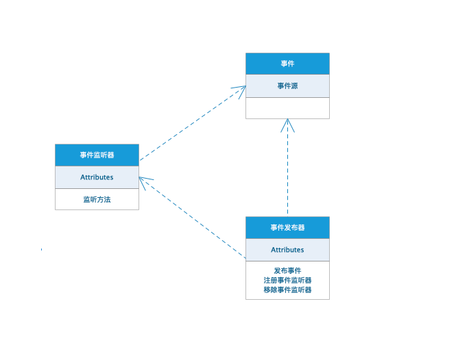
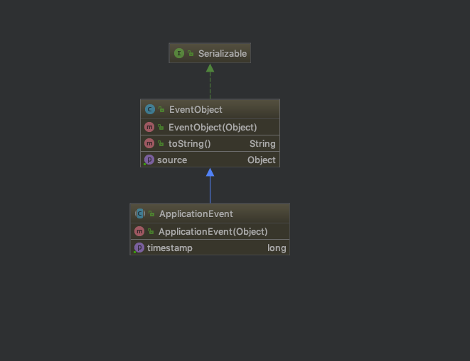
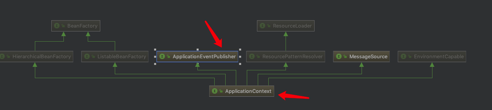

#### 观察者模式

优点：

1. 降低了目标与观察者之间的耦合关系，两者之间是抽象耦合关系。符合依赖倒置原则。
2. 目标与观察者之间建立了一套触发机制。

缺点：

1. 目标与观察者之间的依赖关系并没有完全解除，而且有可能出现循环引用导致系统崩溃。
2. 当观察者对象很多时，通知的发布会花费很多时间，影响程序的效率。
3. 观察者模式没有相应的机制让观察者知道所观察的目标对象是怎么发生变化的，而仅仅只是知道观察目标发生了变化。


#### spring中的事件发布与监听

传统的观察者模式的缺陷：

- 1.抽象主题需要依赖抽象观察者,而这种依赖关系完全可以去除。
- 2.主题需要维护观察者列表,并对外提供动态增删观察者的接口,
- 3.主题状态改变时需要由自己去通知观察者进行更新。

我们可以把主题(Subject)替换成事件(event),把对特定主题进行观察的观察者(Observer)替换成对特定事件进行监听的监听器(EventListener),而把原有主题中负责维护主题与观察者映射关系以及在自身状态改变时通知观察者的职责从中抽出,放入一个新的角色事件发布器(EventPublisher)中,事件监听模式的轮廓就展现在了我们眼前,如下图所示



常见事件监听机制的主要角色如下

- 事件及事件源:对应于观察者模式中的主题。事件源发生某事件是特定事件监听器被触发的原因。
- 事件监听器:对应于观察者模式中的观察者。监听器监听特定事件,并在内部定义了事件发生后的响应逻辑。
- 事件发布器:事件监听器的容器,对外提供发布事件和增删事件监听器的接口,维护事件和事件监听器之间的映射关系,并在事件发生时负责通知相关监听器。

Spring框架对事件的发布与监听提供了相对完整的支持,它扩展了JDK中对自定义事件监听提供的基础框架,并与Spring的IOC特性作了整合,使得用户可以根据自己的业务特点进行相关的自定义,并依托Spring容器方便的实现监听器的注册和事件的发布。因为Spring的事件监听依托于JDK提供的底层支持,为了更好的理解,先来看下JDK中为用户实现自定义事件监听提供的基础框架。


##### JDK中事件监听机制

1、所有可被监听事件的事件基类,  所有自定义事件类型都必须继承该类

```java
public class EventObject implements java.io.Serializable {}
```

2、对所有事件监听器进行抽象的接口java.util.EventListener,这是一个标记接口,内部没有任何抽象方法,所有自定义事件监听器都必须实现该标记接口

```java
public interface EventListener {}
```

3、不要忘了还要定义一个事件发布器来管理事件监听器并提供发布事件的功能。


##### spring监听机制

Spring容器,具体而言是ApplicationContext接口定义的容器提供了一套相对完善的事件发布和监听框架,其遵循了JDK中的事件监听标准,并使用容器来管理相关组件,使得用户不用关心事件发布和监听的具体细节,降低了开发难度也简化了开发流程

- 事件

Spring为容器内事件定义了一个抽象类ApplicationEvent,该类继承了JDK中的事件基类EventObject。因而自定义容器内事件除了需要继承ApplicationEvent之外,还要传入事件源作为构造参数。




- 事件监听器

Spring定义了一个`ApplicationListener`接口作为为事件监听器的抽象

```java
@FunctionalInterface
public interface ApplicationListener<E extends ApplicationEvent> extends EventListener {
   void onApplicationEvent(E event);
}
```

1、该接口继承了JDK中表示事件监听器的标记接口EventListener,内部只定义了一个抽象方法onApplicationEvent(evnt),当监听的事件在容器中被发布,该方法将被调用。

2、同时,该接口是一个泛型接口,其实现类可以通过传入泛型参数指定该事件监听器要对哪些事件进行监听。这样有什么好处？这样所有的事件监听器就可以由一个事件发布器进行管理,并对所有事件进行统一发布,而具体的事件和事件监听器之间的映射关系,则可以通过反射读取泛型参数类型的方式进行匹配

3、最后,所有的事件监听器都必须向容器注册,容器能够对其进行识别并委托容器内真正的事件发布器进行管理。


- 事件发布器

`ApplicationContext`接口继承了`ApplicationEventPublisher`接口,从而提供了对外发布事件的能力,如下所示



那么是否可以说ApplicationContext,即容器本身就担当了事件发布器的角色呢？其实这是不准确的,容器本身仅仅是对外提供了事件发布的接口,真正的工作其实是委托给了具体容器内部一个`ApplicationEventMulticaster`对象,其定义在AbstractApplicationContext抽象类内部,如下所示

```java
/** Helper class used in event publishing */
private ApplicationEventMulticaster applicationEventMulticaster;
```

所以,真正的事件发布器是ApplicationEventMulticaster,这是一个接口,定义了事件发布器需要具备的基本功能:管理事件监听器以及发布事件。其默认实现类是
SimpleApplicationEventMulticaster,该组件会在容器启动时被自动创建,并以单例的形式存在,管理了所有的事件监听器,并提供针对所有容器内事件的发布功能。

